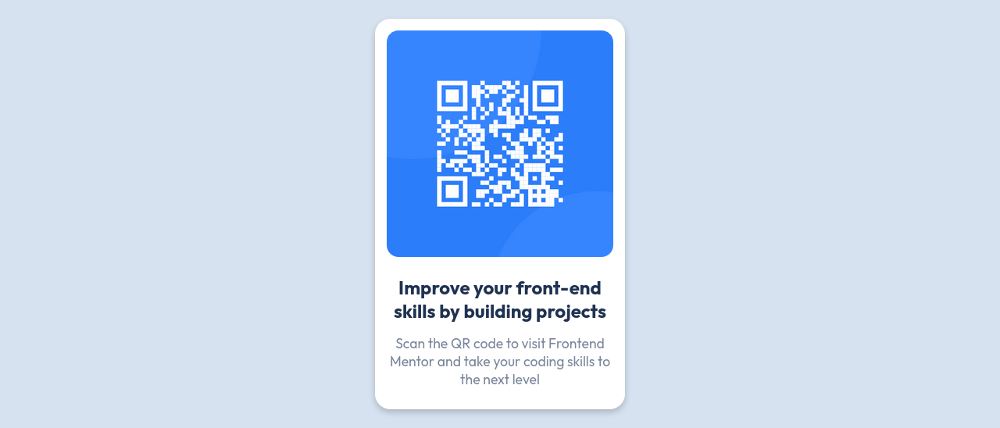

# Frontend Mentor - QR code component solution
Esta é a minha solução para o desafio [QR code component challenge on Frontend Mentor](https://www.frontendmentor.io/challenges/qr-code-component-iux_sIO_H).

## Contéudo

- [Desafio](#desafio)
    - [Solução](#screenshot)
    - [Demo](#demo)
- [Processo de Desenvolvimento](#meu-processo)
    - [Ferramentas](#ferramentas)
    - [O que eu aprendi](#o-que-eu-aprendi)
- [Referencias](#referencia)

## Desafio
Foi proposto recriar o seguinte site, fazendo o mais semelhante possível, a partir de um guia de estilo fornecido.

## Solução:

## Demo:

- [Solução do QR code component solution](https://brunosilvafaria.github.io/qr-code-component-main/)

## Processo de desenvolvimento:
- Definir a Estrutura HTML;
- Estilizar Utilizando CSS;
- Refatorar código (rever estilos e classes).

### Ferramentas

- HTML5
- CSS3
- Arquitetura BEM
- Mobile-first
- JS
- [Google Fonts](https://fonts.google.com)
- [Atom](https://atom.io/) - Editor de texto
- [Adobe Color](https://color.adobe.com/pt/create/color-wheel) - Paleta de cores
- [FireFox](https://www.mozilla.org/pt-BR/firefox/new/) - Navegador utilizado para visualização e desenvolvimento do site
- [SASS](https://sass-lang.com/) - Pré-processador CSS
- [W3Schools](https://www.w3schools.com/) - Documentação.

### O que eu aprendi:

- Box shadown;
- Agrupamento de elementos;
- Disposição e alinhamento de itens.

## Referencias
- https://www.w3schools.com/cssref/css3_pr_box-shadow.asp
